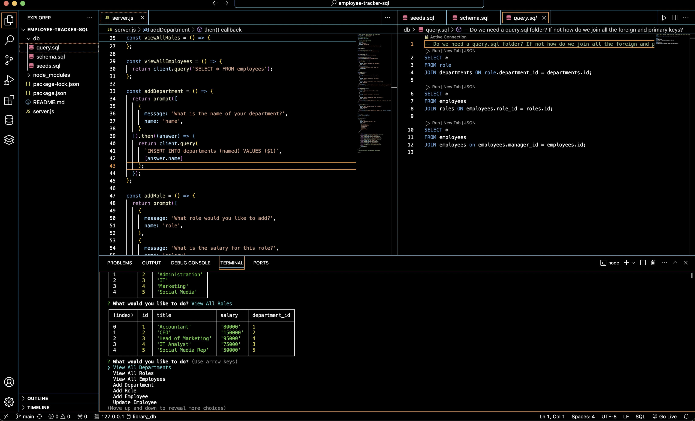
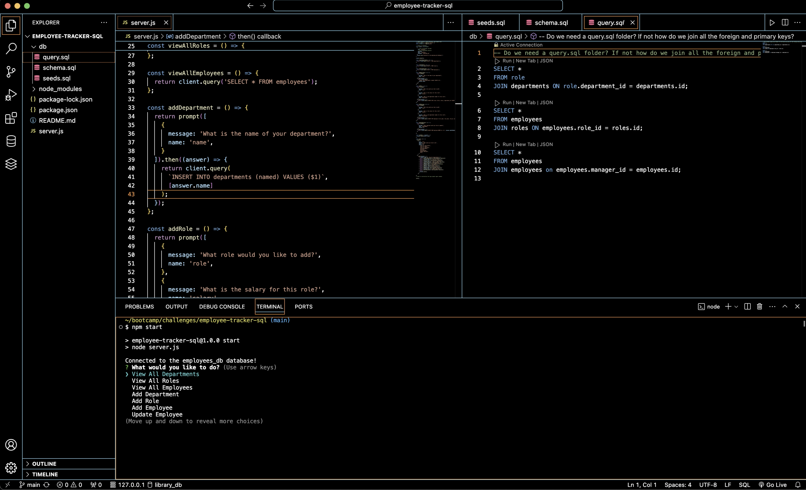

# Employee Tracker - SQL

## Description

As a business owner I want to be able to use a database to track my employees along with their respective information including their names, salaries, roles, and managers.

## Installation

This program uses the `pg` & `inquirer@8.2.4` dependencies.

## Usage

Using the `npm start` command the user will be presented with prompts to choose from. Depending on what the user wants to do their can view the database tables, add/update specific table values, and be presented with the updated tables.

## Links
[gitHub-repo](https://github.com/lllewell/employee-tracker-sql)

[walkthrough-video](https://drive.google.com/file/d/1sabfGVV3XBBJBDpNy_YeSd81JxtWCjcv/view?usp=sharing)